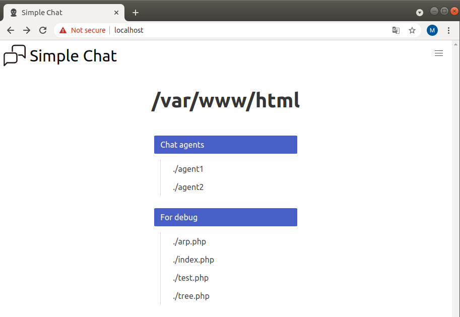
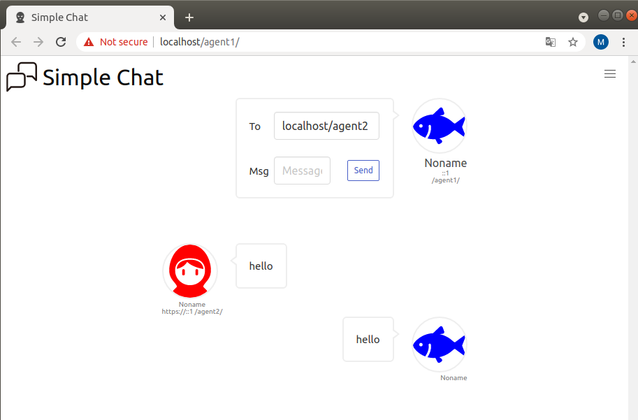

## Simple Chat
This repository provides a simple chat app in a private network for studying.

## Environment
- OS
    - Ubuntu 18.04
- Web server
    - Apache2

## How to launch
1. Install web server
    - `sudo apt install apache2`
2. Open ports for communication changing firewall settings.
    - `sudo apt install ufw`
    - `sudo ufw enable`
    - `sudo ufw default DENY`
    - `sudo ufw allow 80`
3. Clone repository to your work directory
    - `git clone url_to_this_repository.git`
4. Cp repository dir to the root dir of Apache.
    ```
    sudo rm -rf /apache_root_dir/*
    sudo cp -r /path_to_your_workdir/chatapp/* /apache_root_dir
    sudo chmod 777 -R /apache_root_dir
    sudo systemctl reload apache2
    ```
    Note: `chmod 777` setting is weak in security. Set appropriate permissions.
5. Access to the server IP with your browser :
    
    You can find menu of simple chat.
    

    After moving to one of the chat agent, enjoy chatting in the local network! 
    
    Set target IP and msg, then press Send button.

    You can also change your profile from setting screen.
    